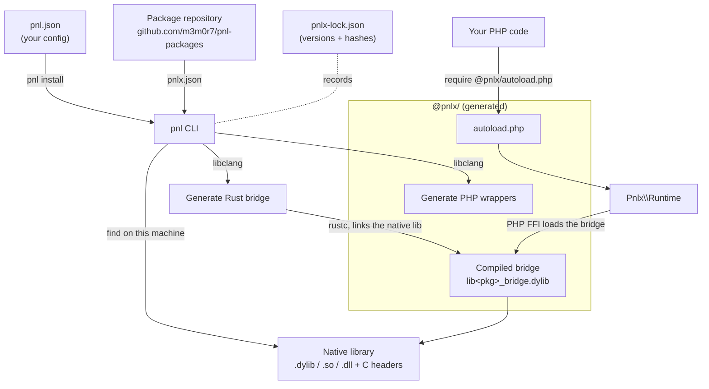

# Overview

[← Documentation index](../../README.md) · [日本語](../ja/overview.md)

## What Is pnl?

In one sentence: **pnl makes it easy to use C libraries from PHP.**

There are many battle-tested libraries out there written in C — `libusb` for talking to USB devices, `libnfc` for NFC, `SDL` for windows, graphics, and sound. The catch is that almost all of them are built for C, and calling them from PHP by hand is painful.

PHP does have FFI (Foreign Function Interface), a mechanism for calling other languages' libraries directly. But using it yourself means copying function signatures by hand, juggling raw pointers, and a lot of fiddly bookkeeping.

pnl automates that pain away. Concretely, it:

- installs library "packages",
- finds the C library and its headers (type information) already installed on your machine,
- **generates wrappers** (PHP classes and methods) so you can call the library from PHP,
- automatically compiles a small **bridge** (glue code written in Rust) that connects PHP and C,
- and exposes everything through the `Pnlx` PHP SDK.

Think of it like Composer, but for using C libraries from PHP.

This repository ships two command-line tools:

- **`pnl`**: the tool for *using* libraries — install, lockfile management, validation, and listing.
- **`pnlx`**: the tool for *authoring* library packages — generating wrappers and rebuilding installed bridges.

If you just want to use libraries, `pnl` is usually all you need.

One thing to note: the generated install state lives in a dedicated `@pnlx/` directory, not Composer's `vendor/`. In your PHP code you load Composer's autoload first (for the SDK), then `@pnlx/autoload.php` (for the installed extensions).

## The Big Picture

A typical first-time flow looks like this:

1. Build/install `pnl` and `pnlx` ([Build And Install](installation.md#build-and-install)).
2. Run `pnl init` in your project to create the `pnl.json` config file.
3. Run `pnl install <library URL>` to add the library you want.
4. Call the library from PHP through `Pnlx\Runtime` ([PHP Usage](php-usage.md#php-usage)).

If you just want to get a feel for it, start with the install in step 3 and the sample code in step 4.

### How It Works

At install time, `pnl` finds the native library and its C headers, generates PHP wrappers plus a small Rust **bridge**, and compiles that bridge into a dynamic library. At runtime, the `Pnlx` SDK loads the compiled bridge through PHP's FFI and forwards your calls into C.

- **`pnl`** resolves and installs packages; **`pnlx`** authors them (generates the wrappers/bridge).
- The generated PHP and the compiled bridge live under `@pnlx/`; you load them with one `require`.
- `pnlx-lock.json` (next to `pnl.json`) pins the installed versions and content hashes so installs are reproducible.

## Status

This repository is an early implementation (a prototype).

Installing directly from a local path, a `file://` URL, or a Git URL (GitHub, GitLab, Bitbucket, or any generic host) works for any package that contains `pnlx.json`. A package's native libraries and headers can also be fetched over `http(s)`, `ftp`, or `git` (see [Native library discovery](configuration.md#native-library-discovery)). On the other hand, repository-index dependency solving and signed package indexes are still design-stage work.
