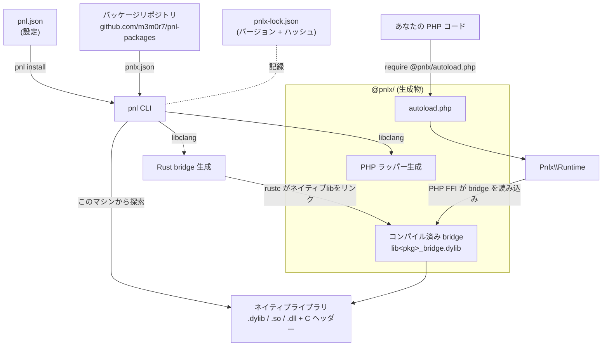

# 概要

[← ドキュメント目次](../../README.ja.md) · [English](../en/overview.md)

## pnl とは

ひとことで言うと、**PHP から「C 言語で書かれた既存のライブラリ」を簡単に使えるようにするツール**です。

世の中には、USB 機器を操作する `libusb`、NFC を扱う `libnfc`、ウィンドウや画像・音を扱う `SDL` のように、長年使われてきた便利なライブラリがたくさんあります。ただし、これらはほとんどが C 言語向けに作られていて、PHP からそのまま呼び出すのは大変です。

PHP には FFI（Foreign Function Interface）という「他言語のライブラリを直接呼ぶ仕組み」がありますが、自分で使おうとすると、関数の型を手で書き写したり、ポインタを直接さわったりと、かなり骨が折れます。

pnl は、この面倒な部分を自動化します。具体的には次のことをやってくれます。

- ライブラリの「パッケージ」をインストールする
- パソコンにインストール済みの C ライブラリ本体とヘッダー（型情報）を探し出す
- PHP から呼び出すための **ラッパー（PHP のクラスやメソッド）を自動生成**する
- PHP と C の橋渡しをする小さな **bridge（Rust 製のつなぎコード）** を自動でコンパイルする
- 生成したコードを `Pnlx` という PHP SDK 経由で呼び出せるようにする

イメージとしては、Composer がパッケージ管理をしてくれるのと同じ感覚で、C ライブラリを PHP から使えるようにしてくれる、と考えてください。

このリポジトリには 2 つのコマンドラインツールが含まれます。

- **`pnl`**: ライブラリを「使う側」のツール。インストール、ロックファイル管理、検証、一覧表示を行います。
- **`pnlx`**: ライブラリのパッケージを「作る側」のツール。ラッパーの生成や、インストール済み bridge の再ビルドを行います。

ふだんライブラリを使うだけなら、基本的に `pnl` だけ覚えれば十分です。

なお、生成されたインストール内容は Composer の `vendor/` ではなく、専用の `@pnlx/` ディレクトリに置かれます。PHP 側では、まず Composer の autoload で SDK を読み込み、続いて `@pnlx/autoload.php` でインストール済みの拡張を読み込みます。

## ざっくりした流れ

初めて使うときの典型的な流れは次のとおりです。

1. `pnl` と `pnlx` をビルド／インストールする（[ビルドとインストール](installation.md#ビルドとインストール)）
2. プロジェクトで `pnl init` を実行し、設定ファイル `pnl.json` を作る
3. `pnl install <ライブラリのURL>` で使いたいライブラリを入れる
4. PHP コードから `Pnlx\Runtime` 経由でライブラリを呼ぶ（[PHP からの使い方](php-usage.md#php-からの使い方)）

まずは雰囲気をつかみたい場合、3 のインストールと 4 のサンプルコードから読むのがおすすめです。

### 仕組み

インストール時、`pnl` はネイティブライブラリと C ヘッダーを探し、PHP のラッパーと小さな Rust の **bridge** を生成し、その bridge を動的ライブラリへコンパイルします。実行時には、`Pnlx` SDK が PHP の FFI 経由でコンパイル済み bridge を読み込み、あなたの呼び出しを C へ橋渡しします。

- **`pnl`** はパッケージの解決・インストールを担当し、**`pnlx`** はパッケージの作成（ラッパー／bridge の生成）を担当します。
- 生成された PHP とコンパイル済み bridge は `@pnlx/` 配下に置かれ、1 回の `require` で読み込めます。
- `pnlx-lock.json`（`pnl.json` と同じ階層）はインストール済みバージョンと内容ハッシュを固定し、再現可能なインストールを保証します。

## ステータス

このリポジトリは初期実装（プロトタイプ）です。

`pnlx.json` を含むパッケージであれば、ローカルのパス・`file://`・Git/GitHub の URL・配布アーカイブ（`.tar.gz`/`.zip`）から直接インストールできます。一方で、リポジトリインデックスを使った依存解決、署名付きパッケージインデックス、FTP ダウンロードなどはまだ設計段階です。
